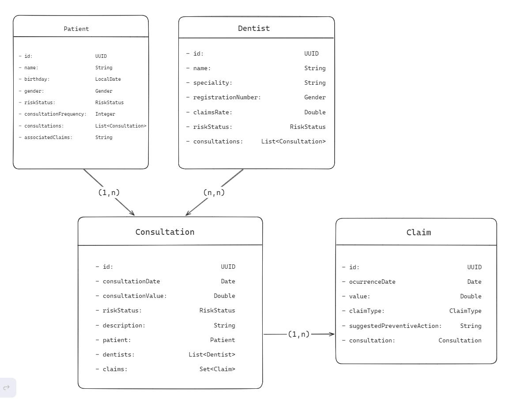
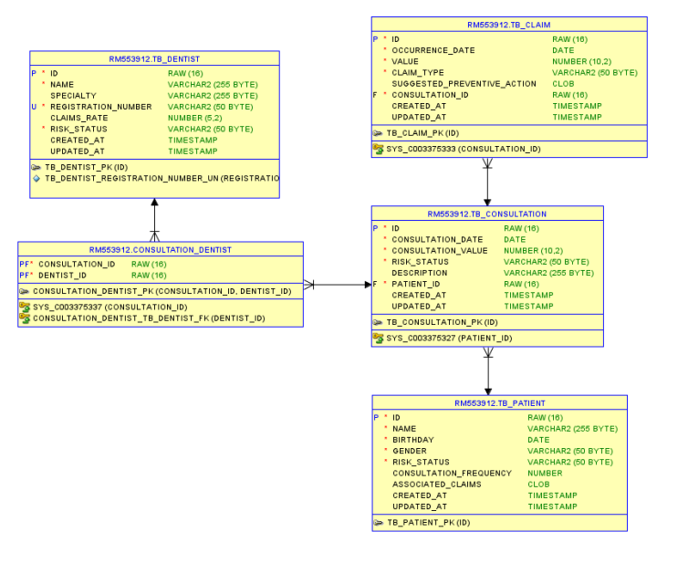

# Projeto Aletheia

### Integrantes:

Natan Junior Rodrigues Lopes   RM: 552626

Pedro Lucca Medeiros Miranda   RM: 553873

Pedro Moreira de Jesus         RM: 553912

## Apresentação do projeto

A Aletheia trata-se de um sistema que tem
o objetivo de colher informações de clientes,
médicos e consultas, para posteriormente utilizando
Inteligência Artificial e Ciência de Dados,
prever e classificar padrões de consultas que
indicam fraudes ou golpes que possam prejudicar
uma empresa.

Com o intuito de colher as informações que usaremos
para criar nosso Dataset, nós prototipamos um Frontend.
Um aplicativo mobile responsável por colher dados de
consultas, pacientes e dentistas. O backend de nossa
aplicação está sendo feito com Java utilizando o
Spring framework.

## Diagramas
##
### Diagrama das entidades da camada de modelo
##

##
### Diagrama lógico relacional do banco de dados
##

##

## Tabela de endpoints
##
| Categoria       | Método | Endpoint                      | Descrição                        |
|-----------------|--------|------------------------------|----------------------------------|
| **Dentists**    | GET    | `/api/dentists`              | Retorna todos os dentistas      |
|                 | GET    | `/api/dentists/{id}`         | Retorna um dentista específico  |
|                 | POST   | `/api/dentists`              | Cria um novo dentista           |
|                 | DELETE | `/api/dentists/{id}`         | Deleta um dentista específico   |
| **Patients**    | GET    | `/api/patients`              | Retorna todos os pacientes      |
|                 | GET    | `/api/patients/{id}`         | Retorna um paciente específico  |
|                 | POST   | `/api/patients`              | Cria um novo paciente           |
|                 | DELETE | `/api/patients/{id}`         | Deleta um paciente específico   |
| **Claims**      | GET    | `/api/claims`                | Retorna todas as reclamações    |
|                 | GET    | `/api/claims/{id}`           | Retorna uma reclamação específica|
|                 | POST   | `/api/claims`                | Cria uma nova reclamação        |
|                 | DELETE | `/api/claims/{id}`           | Deleta uma reclamação específica|
| **Consultations**| GET    | `/api/consultations`        | Retorna todas as consultas      |
|                 | GET    | `/api/consultations/{id}`    | Retorna uma consulta específica |
|                 | POST   | `/api/consultations`         | Cria uma nova consulta          |
|                 | DELETE | `/api/consultations/{id}`    | Deleta uma consulta específica  |
