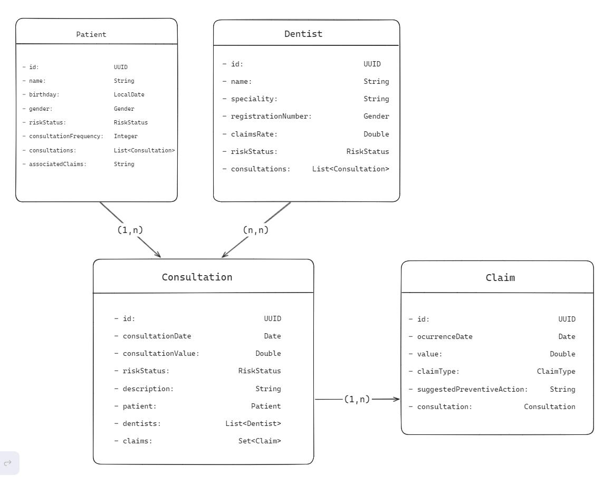
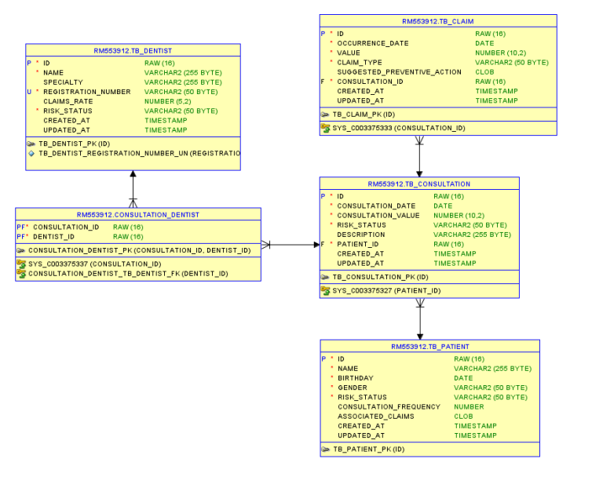

# Projeto Aletheia

### Integrantes:

Natan Junior Rodrigues Lopes   RM: 552626

Pedro Lucca Medeiros Miranda   RM: 553873

Pedro Moreira de Jesus         RM: 553912

## Apresentação do projeto

A Aletheia trata-se de um sistema que tem
o objetivo de colher informações de clientes,
médicos e consultas, para posteriormente utilizando
Inteligência Artificial e Ciência de Dados,
prever e classificar padrões de consultas que
indicam fraudes ou golpes que possam prejudicar
uma empresa.

Com o intuito de colher as informações que usaremos
para criar nosso Dataset, nós prototipamos um Frontend.
Um aplicativo mobile responsável por colher dados de
consultas, pacientes e dentistas. O backend de nossa
aplicação está sendo feito com Java utilizando o
Spring framework e será responsável pela persistência das
informações colhidas pelo frontend no banco de dados.

## Diagramas
##
### Diagrama das entidades da camada de modelo
##

##
### Diagrama lógico relacional do banco de dados
##


##

## Tabela de endpoints
##
| Categoria       | Método | Endpoint                      | Descrição                        |
|-----------------|--------|------------------------------|----------------------------------|
| **Dentists**    | GET    | `/api/dentists`              | Retorna todos os dentistas      |
|                 | GET    | `/api/dentists/{id}`         | Retorna um dentista específico  |
|                 | POST   | `/api/dentists`              | Cria um novo dentista           |
|                 | DELETE | `/api/dentists/{id}`         | Deleta um dentista específico   |
| **Patients**    | GET    | `/api/patients`              | Retorna todos os pacientes      |
|                 | GET    | `/api/patients/{id}`         | Retorna um paciente específico  |
|                 | POST   | `/api/patients`              | Cria um novo paciente           |
|                 | DELETE | `/api/patients/{id}`         | Deleta um paciente específico   |
| **Claims**      | GET    | `/api/claims`                | Retorna todas as reclamações    |
|                 | GET    | `/api/claims/{id}`           | Retorna uma reclamação específica|
|                 | POST   | `/api/claims`                | Cria uma nova reclamação        |
|                 | DELETE | `/api/claims/{id}`           | Deleta uma reclamação específica|
| **Consultations**| GET    | `/api/consultations`        | Retorna todas as consultas      |
|                 | GET    | `/api/consultations/{id}`    | Retorna uma consulta específica |
|                 | POST   | `/api/consultations`         | Cria uma nova consulta          |
|                 | DELETE | `/api/consultations/{id}`    | Deleta uma consulta específica  |

# Como Rodar

Siga os passos abaixo para configurar e rodar o projeto localmente:

### Pré-requisitos

Antes de começar, certifique-se de ter as seguintes ferramentas instaladas:

- [Java JDK 21+](https://www.oracle.com/java/technologies/javase-jdk21-downloads.html)
- [Maven 3.8+](https://maven.apache.org/download.cgi)
- [Git](https://git-scm.com/) para clonar o repositório
- [Docker](https://www.docker.com/products/docker-desktop/) para rodar a aplicação no container

### Passos para Rodar sem Docker

1. **Clone o Repositório**

   Abra o terminal e execute o seguinte comando:

   ```bash
   git clone https://github.com/seu-usuario/odontoprev-spring.git
   ```

2. **Navegue até o Diretório do Projeto**

   Acesse o diretório clonado:

   ```bash
   cd odontoprev-spring
   ```
   
3. **Rode o programa**

   Ao rodar o programa, as dependências serão instaladas e a aplicação iniciará um servidor na porta 8080.


4. **Testando os Endpoints**

   Você pode testar os endpoints da API diretamente no seu navegador ou utilizando ferramentas como Postman. A lista completa de endpoints está disponível na seção Endpoints da API deste README.

### Passos para Rodar com Docker

1. **Clone o Repositório**

   Abra o terminal e execute o seguinte comando:

   ```bash
   git clone https://github.com/seu-usuario/odontoprev-spring.git
   ```

2. **Navegue até o Diretório do Projeto**

   Acesse o diretório clonado:

   ```bash
   cd odontoprev-spring
   ```

3. **Construa a Imagem Docker**

   Execute o seguinte comando para construir a imagem Docker:

   ```bash
   docker build -t aletheia-app .
   ```

4. **Execute o Container Docker**

   Inicie o container:

   ```bash
   docker run -p 8080:8080 aletheia-app
   ```
   A aplicação será iniciada no servidor local na porta 8080.

## Link para o vídeo pitch do projeto

[Acesse clicando aqui](https://youtu.be/MHIPHuJgK2s)
